# Backend by NestJS

## データベースの準備

必要なライブラリをインストールする。

```bash
npm install --save @prisma/client
npm install --save-dev prisma dotenv-cli
```

データモデルとして以下を準備する。



## 作成する API

- `POST /auth/signup`
- `POST /auth/signin`
- `POST /auth/signout`
- `POST /auth/refresh`
- `GET /auth/me`
- `GET /tasks`
- `POST /tasks`
- `GET /tasks/:taskId`
- `PATCH /tasks/:taskId`
- `DELETE /tasks/:taskId`

インターフェースの管理をやりやすいように、Swagger を導入する。

```bash
npm install --save @nestjs/swagger swagger-ui-express
```

後は `setup.ts` で作成したアプリケーションに対して Swagger の設定を追加する。

```ts
export const setup = (app: INestApplication): INestApplication => {
  const config = new DocumentBuilder()
    .setTitle('認証システム')
    .setDescription('タスク管理を例題に認証システムを構築する')
    .setVersion('0.1')
    .addTag('auth')
    .build();
  const document = SwaggerModule.createDocument(app, config);
  SwaggerModule.setup('api', app, document);

  return app;
};
```
